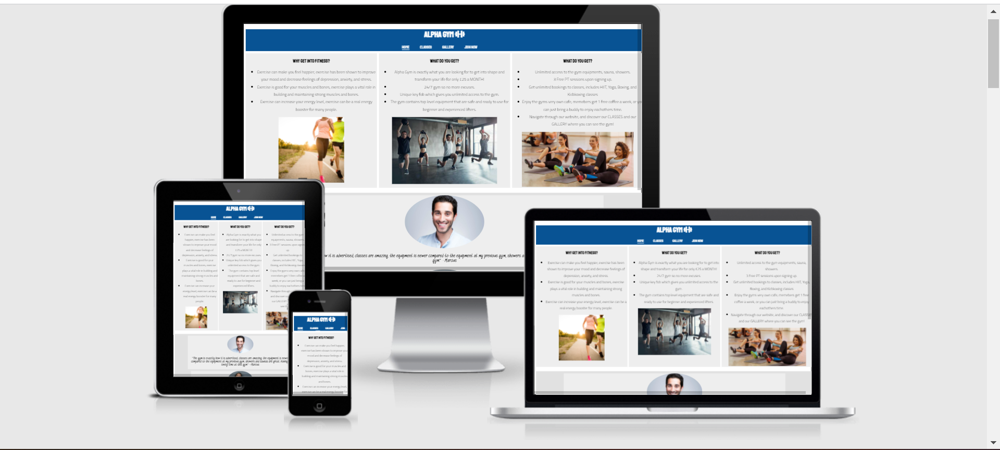
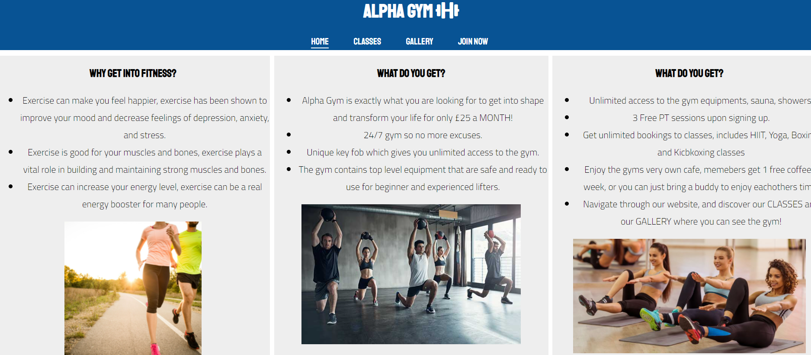
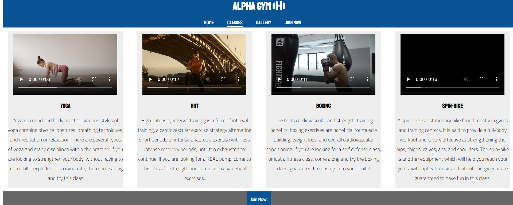
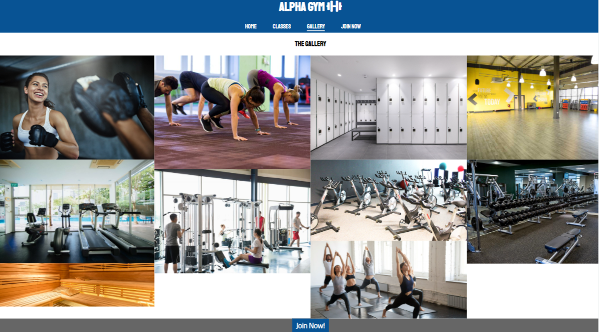
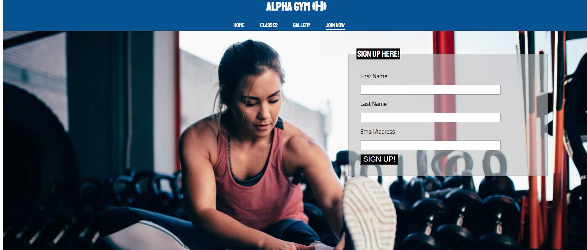
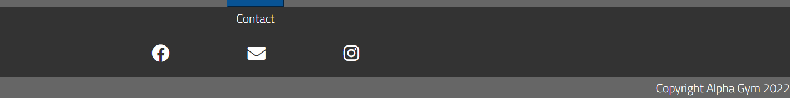
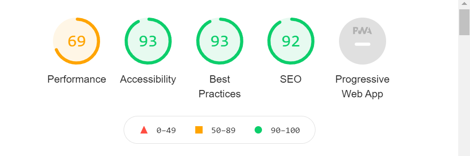

<h1>What is Alpha Gym -</h1>

Alpha Gym is a website designed to target people who are getting into fitness or are looking to join their local gym. The website will have information on why people should start getting into fitness, WHY they should join Alpha Gym and what this gym has to offer upon becoming a member

The Alpha Gym website will also have content such as classes to show people what the classes are that they can sign up to, a gallery of the gym to be a ble to view it prior to visiting it, and a join now page where they can become members.

<h2>User Features</h2>

<ul>
    <li>Title and Navigation bar</li>
        <ul>
            <li>When first opening the website the first thing you are going to see is the title of the website AND right below it the navigation bar. The 'Alpha Gym' title will also work as a link and will do the same thing as the 'Home' link which will be to redirect the user to the home page. The Navigation bar includes a 'Home', 'Classes', 'Gallery' and a 'Join Now' link.</li>
            <li>The navigation bar makes it clear and easy for the user to navigate through the website and look for information that is wanted, the 'Classes' page will have information on what kind of classes the gym offers, the 'Gallery' will contain images of the gym, people like to see how a gym looks like before they come and visit.</li>
            <li>The links will be responsive for when users hover over it and the page you're currently on will be underlined, just a feature to help users know where they are on the site</li>
            <li>Navigation bar will always be at the top of the screen for when users scroll to the bottom, they would still be able to select a different page without having the need to scroll up.</li>
        </ul>
</ul>

<ul>
    <li>Home Page</li>
        <ul>
            <li>The main page will have 3 sections with information regarding the gym. The left section will have information on the benefits of getting into fitness.
            </li>
            <li>The center section will have information on why 'Alpha Gym' is the gym you would want to go to instead of other local gyms. Such as the benefits of joining this gym and it's competitive price.</li>
            <li> Then right below all of the information there will be a "Join Now!" button which will take users to the Join Now page</li>
            <li>Below this section there will be a a testimonial section from current members to help persuade people looking at the site to join.</li>
            <li>Below the testimonial section there will be the a join now button which will redirect them to the form which will help them sign up.</li>
        </ul>
</ul>

<ul>
    <li>Classes page</li>
        <ul>
            <li>In this webpage there will be four columns, listing the classes that the gym has to offer which are Yoga, HIIT, Boxing and Spin class</li>
            <li>Below each class there will be a video of what members are going to expect in each class and information of what the class is going to offer. Users will have full control of the video playback, volume control etc.</li>
            <li>There will be little icons for each class, makes it more appealing for users when they first visit the page</li>
            <li>And again, a join now button will be at the bottom of the main body</li>
        </ul>
</ul>

<ul>
    <li>Gallery page</li>
        <ul>
            <li>This webpage is going to be full of images of the gym, the equipment that can be accessed such as dumbbell, squat racks, bench press, cable machines, also pictures of the studios,classes, showers and sauna.</li>
            <li>This is helps people looking to join a gym to get a good idea of what a gym looks like and puts them more at ease</li>
        </ul>
</ul>

<ul>
    <li>Join Now Form</li>
        <ul>
            <li>In the final page it is going to be the join now form</li>
            <li>In this form we will be requesting the users First name, their last name and their email address in order to sign up for the gym.</li>
            <li>Will have a 'Submit' button, the input text box's will also be responsive for when users hover over it</li>
        </ul>
</ul>

<ul>
    <li>Contact and Community links</li>
        <ul>
            <li>Contact information can be found at the bottom of all the webpages, this ensures that if they have any queries, or want to look at more images or reviews of the gym the can click on the Facebook and Instagram links to find these informations. Email link will also be available incase they want to be contacted through there instead of their personal/private accounts.</li>
            <li>Email link will also be available incase they want to be contacted through there instead of their personal/private accounts.</li>
            <li>Users that frequently visit the webpage can use the social media links to go to the community webpages where the can see constant updates of the gym, blogs and reviews.</li>
        </l>
</ul>

<h2>The Design</h2>

<ul>
    <li>Colors</li>
        <ul>
            <li>The main colours that are going to be used in this website are blue (#085394) and white.</li>
            <li>Main title and Nav bar will have a blue background with the font-colour being white</li>
            <li>Information of the webpage, the classes icon and the information there will have a black font. The description boxes will have a VERY light grey background</li>
            <li>The footer is going to be black and the copyright section is going to be grey, both dark colours with white fonts to stand out from its background</li>
        </ul>
    <li>Fonts</li>
        <ul>
            <li>The fonts that are going to be used are 'Staatliches 400' for title and sub-headings</li>
            <li>For paragraphs I am using the 'Cairo 300' font</li>
            <li>And for the review section in the main page I am using "Caveat 400"</li>
        </ul>
    <li>Pictures</li>
        <ul>
            <li>I am going to be using a background image for the join now form section, the form box is going to be transparent to make it more creative. The input text box's are going to be responsive for when the user hovers over it.</li>
            <li>There will be 5 images in the main page, 4 videos in the classes page, showing users what they are going to expect in these classes, and the gallery will have 10 images of what the gym looks like, such as gym equipment, sauna, studios, classes etc.</li>
        </ul>
</ul>
<h2>Wireframes</h2>

<h2>Features</h2>

<ul>
    <li>Responsive on all device sizes</li>
        <ul>
            <li></li>
        </ul>
    <li>Interactive elements</li>
        <ul>
            <li>Links will change colors when users hover over them, except for the Main title, nav bar links will get a background of white and a font color of blue(#085394) </li>
        </ul>
</ul>

<h2>Technologies used</h2>
<ul>
    <li>Languages used</li>
        <ul>
            <li>HTML5</li>
            <li>CSS3</li>
        </ul>
    <li>Frameworks, libraries and Programs used</li>
        <ul>
            <li>Google Fonts</li>
            <li>Font Awesome</li>
            <li>Github</li>
            <li>Gitpod</li>
            <li>Balsamiq</li>
        </ul>
</ul>

<h2>Testing</h2>

The testing for the website that was used is 'W3C Markup Validator' for HTML and for the CSS I used 'W3C CSS Validator' and for accessibility I used the lighthouse feature from google.

<!-- Input here cropped image of the results -->
<ul><h3>CSS</h3>
    <li>There were no errors found when passing my CSS code in the W3C CSS validator</li>
    <li>Passing through the HTML validator my website did fail on the button, as I stored a button input in an anchor element, this is no solved</li>
    <li>There were warnings on some pages regarding the section areas, it was asking for headers, problems now solved</li>
</ul>
<ul><h2>Accessibility</h2>
    <li>I used the lighthouse feature on devtools to show that the colors used, sizes of fonts and the way the site has been structured is easy to read</li>

</ul>

<ul>Bugs
    <li>When I deploy my website on the classes, the yoga video is not working, but on the gitpod server it works perfectly??</li>
</ul>

<h2>Deployment</h2>

<ul>
    <li>GitHub Pages</li>
        <ol><h3>To deploy my website I did the following...</h3>
            <li>Go on to Github and navigate to the the repository that is wanted to be delpoyed</li>
            <li>Select it and then click on settings which can be found JUST above the Gitpod button</li>
            <li>The screen will open up to general settings, you will scroll down until you find Github Pages, select this</li>
            <li>On this page go to source, edit the branch to '/main' and the folder make sure it is on '/(root)', click save and then a link will be generated for your website</li>
            <li>You can now deploy your website online</li>
        </ul>
    <li>Forking the GitHub repository</li>
        <ul>
            <li></li>
        </ul>
    <li>Making a local clone?</li>
        <ul>
            <li></li>
        </ul>
</ul>
<h2>Credits</h2>
<ul>
    <li>Credits to Code isntitute for allowing me to use their README template as a reference and allowing me to use their pre-built website base<li>
    <li>Thanks to font-awesome for letting my use their services to be able to add icons in my webpage</li>
    <li>Credit to pexels for the free videos available, was able to input 4 fitness videos that came from there.</li>
</ul>

<ul>
    <li>Code</li>
        <ul>
            <li>The Masonary layout code was taken from the Love Running projects gallery</li>
        </ul>
    <li>Media</li>
        <ul>
            <li>Videos were retrieved using [Pexels](https://www.pexels.com/)</li>
            <li>The other images were just found on google searching keywords such as fitness, gym, gym classes, gym equipment</li>
        </ul>
    <li>Acknowledgements</li>
        <ul>
            <li></li>
        </ul>
</ul>